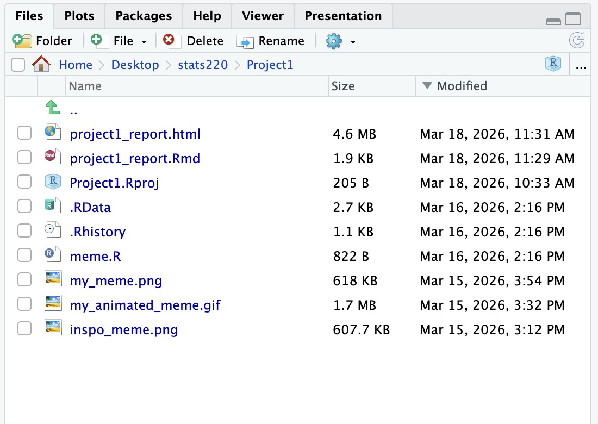
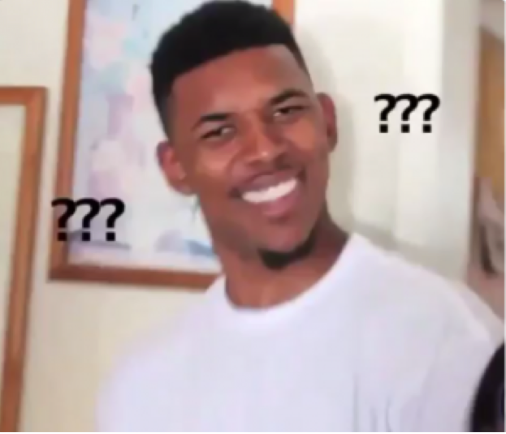
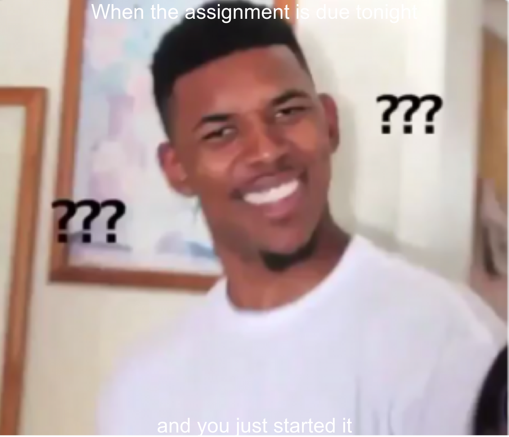

---

## Project requirements

### Project folder

### GitHub repository
[My GitHub repo](https://github.com/Patrickzzhy/stats220)
## Inspo meme

This is the meme that inspired my project.

This meme shows a confused reaction and is often used when someone does not understand a situation.

## My meme

This is the meme I created using R and the magick package.

I added text to the top and bottom of the image to show the feeling of realizing that an assignment is due tonight and you just started it.

## My Animated meme

Here is the animated version of my meme.

The animation shows increasing confusion using more question marks in each frame.

## Creativity

My project demonstrates creativity by using an animated meme instead of only a static image. 
I created multiple frames with increasing question marks to represent confusion.
This visual change helps make the meme more expressive and humorous. 
The animation makes the message clearer and more engaging compared with a single image. 
Using animation also shows how R can be used creatively for visual communication.

## Learning reflection

In this project I learned how to use the magick package in R to create and edit images. I learned how to read an image using image_read and how to add text using image_annotate. I also learned how to create a simple animation by combining several frames and using the image_animate function. This project showed me that R can be used not only for statistical analysis but also for creative tasks like generating memes and animations. I found it interesting to see how code can be used to manipulate images.