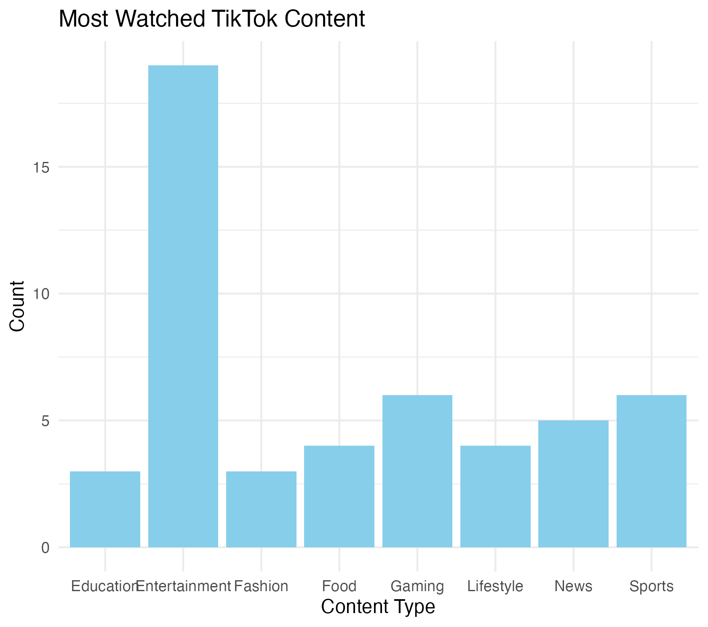
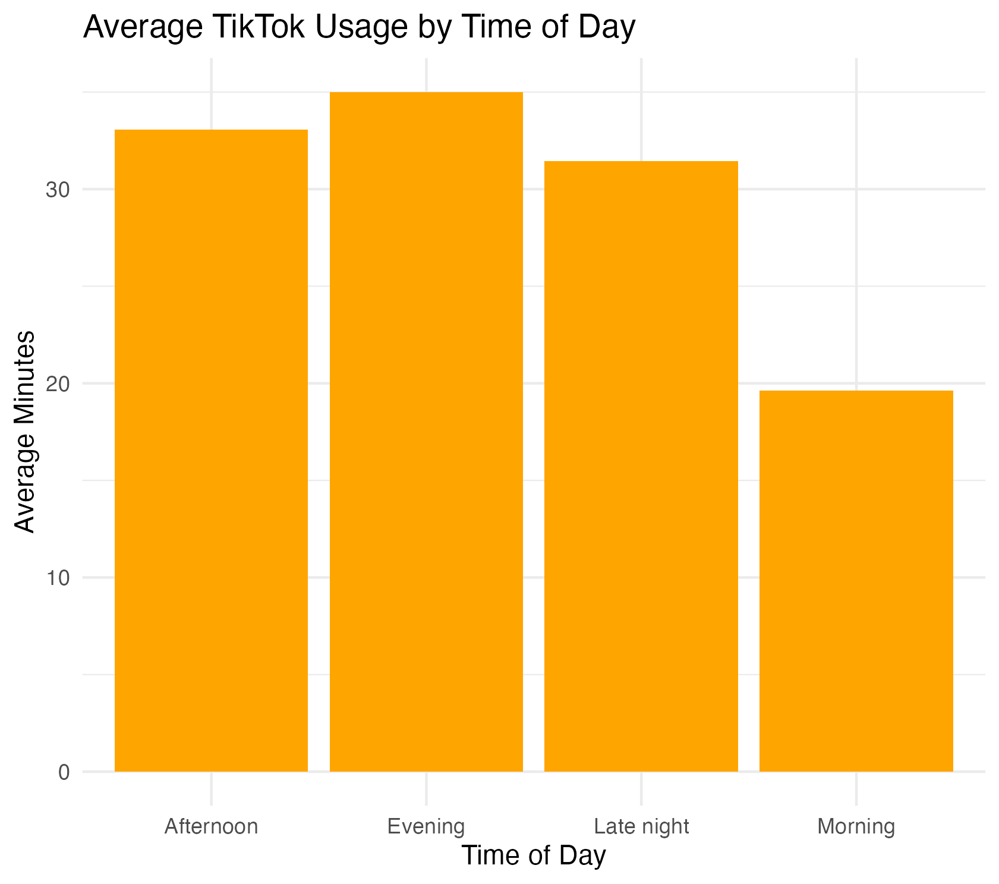
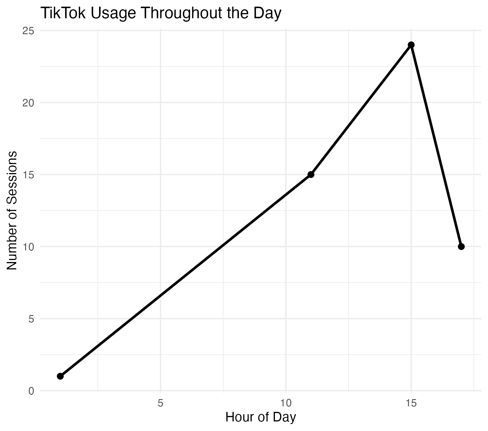

\---
title: My visual data story
output: html_document
---

<script src="https://code.jquery.com/jquery-3.7.1.min.js" integrity="sha256-/JqT3SQfawRcv/BIHPThkBvs0OEvtFFmqPF/lYI/Cxo=" crossorigin="anonymous"></script>

```{r setup, include=FALSE}
knitr::opts_chunk$set(echo=FALSE, message=FALSE, warning=FALSE, error=FALSE)
```

```{js}
$(function() {
  $(".level2").css('visibility', 'hidden');
  $(".level2").first().css('visibility', 'visible');
  $(".container-fluid").height($(".container-fluid").height() + 300);
  $(window).on('scroll', function() {
    $('h2').each(function() {
      var h2Top = $(this).offset().top - $(window).scrollTop();
      var windowHeight = $(window).height();
      if (h2Top >= 0 && h2Top <= windowHeight / 2) {
        $(this).parent('div').css('visibility', 'visible');
      } else if (h2Top > windowHeight / 2) {
        $(this).parent('div').css('visibility', 'hidden');
      }
    });
  });
})
```

```{css}
.figcaption {display: none}
```
## What content do I watch most?

TikTok entertainment videos were the most common type of content in my data collection. 
This shows that I mainly use TikTok for fun and relaxation instead of education or news.



## When do I spend the most time on TikTok?

The average TikTok usage time was highest during the evening. 
This suggests that I spend more time scrolling TikTok after finishing study or daily activities.



## What time am I most active on TikTok?

The line graph shows that most TikTok activity happened during the afternoon and evening hours. 
There were fewer sessions during the morning.


